# UChicago CS Dev Container - User Documentation

This page describes how to install and use the UChicago CS Dev Container.

## Software Prerequisites

To use the dev container, you will need to install [Docker](https://www.docker.com/) on your computer.

- **macOS**: Install either [Collima](https://github.com/abiosoft/colima) or [Docker Desktop for Mac](https://docs.docker.com/desktop/setup/install/mac-install/).
- **Windows**: Install [Docker Desktop for Windows](https://docs.docker.com/desktop/setup/install/windows-install/). Please note that you must set it up to use the [WSL 2 backend](https://docs.docker.com/desktop/features/wsl/)
- **Linux**: Install [Docker Engine](https://docs.docker.com/engine/install/). By default, you will need to use `sudo` to run Docker commands. If you want to run Docker commands without `sudo`, follow the instructions in the [Post-installation steps for Linux](https://docs.docker.com/engine/install/linux-postinstall/) page.

Dev containers are supported in a variety of code editors. If you plan to use the dev container with [Visual Studio Code](https://code.visualstudio.com/), you will need to install the [Dev Containers extension](https://marketplace.visualstudio.com/items?itemName=ms-vscode-remote.remote-containers).

You can also run and manage devcontainers from a terminal, without using a specific code editor. To do so, you will need to install the [Dev Container CLI](https://github.com/devcontainers/cli) (please note that you do *not* need to install the CLI if you are planning to use Visual Studio Code)

## Using the Dev Container in Visual Studio Code

To use the dev container in Visual Studio Code, first make sure that you have opened the folder where you want to use the dev container, instead of an individual file. If you see this in the file explorer:

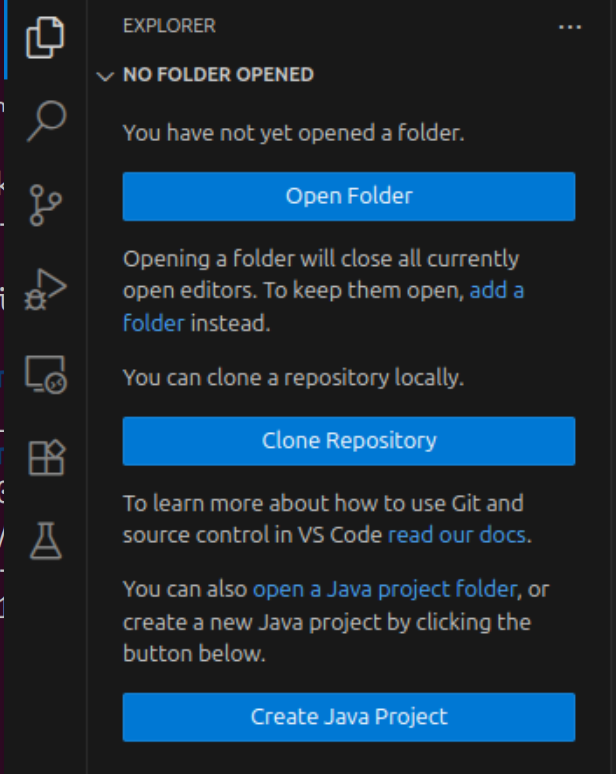

Then you need to open a folder first. You can do this by going to clicking on "Open Folder" and selecting the folder you want to open (this will typically be the root of a Git repository you are working)

### Adding the Dev Container Configuration to Your Project

To use the dev container, you will first need to add a series of configuration files to your project. The steps described here only need to be performed **once** per project.

To add the configuration files, open the command palette (Ctrl+Shift+P or Cmd+Shift+P) and search for "Dev Containers: Add Dev Container Configuration Files..." and select it:

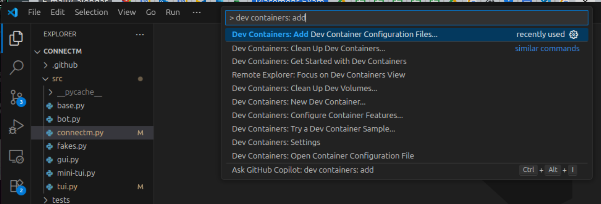

You will then be asked to specify where the configuration files should be stored:

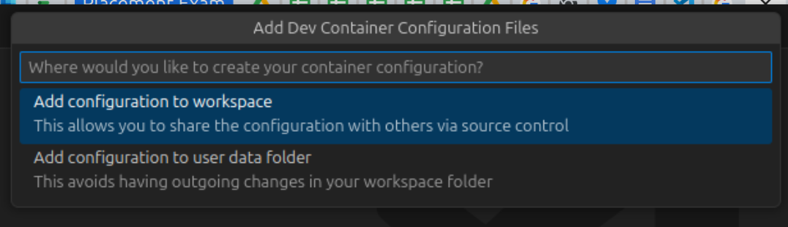

You have two options:

- **Add configuration to workspace**: This will add the files in a `.devcontainer/` directory inside the directory you have opened in VS Code. This will allow you to add those files to your Git repository, which can then make it easier to use and set up the dev container on other computers. This is the recommended option in most cases.
- **Add configuration to user data folder**: This will add the configuration in a VS Code specific location on your computer. This will allow you to use the dev container only on your computer, but you won't need to add any files to your Git repository. Choose this option only if there is a good reason to *not* add the dev container files to your repository.

After selecting an option, you will be asked to "Select a container configuration template or enter a custom template id":

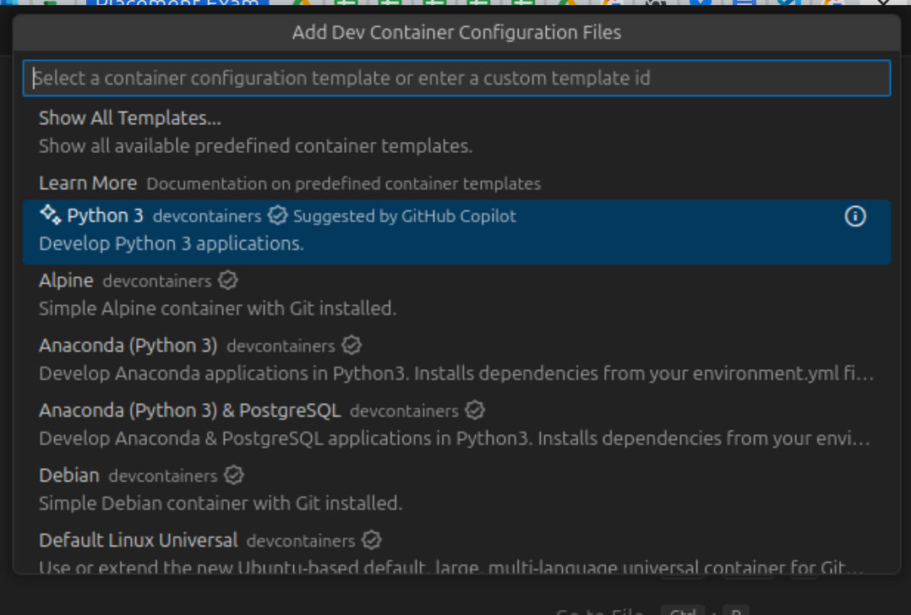

*Do not select any option from the pull-down list*. Instead, enter the following value in the text box:

```
ghcr.io/uchicago-cs/devcontainers/cmsc
```

You will be asked to confirm that you want to use this template:

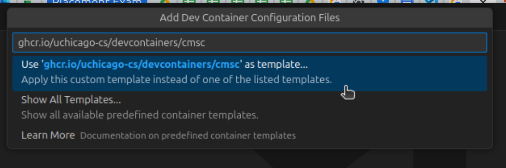

Once you've done this, you will be asked whether you want to add any additional features to the dev container:

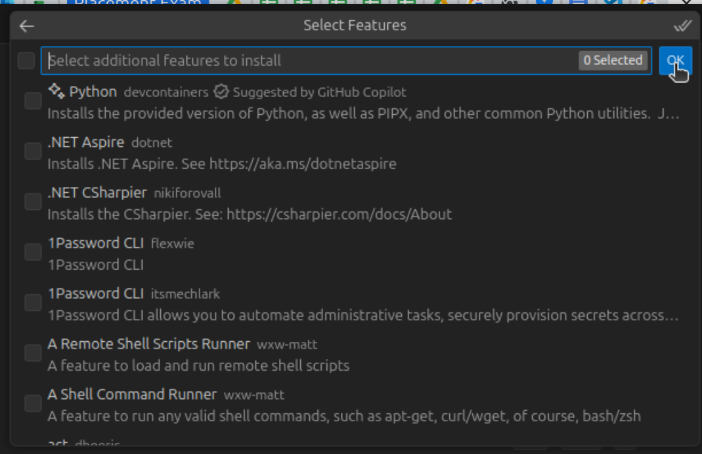

*Do not select any features*. Instead, click "Ok".

At this point, the configuration files will be added to your project. You should see a `.devcontainer` directory in the file explorer:

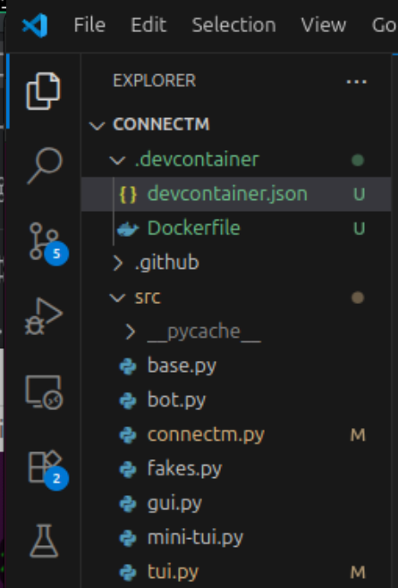

Do not modify the contents of these files.

### Starting the Dev Container for the First Time

Once the configuration files have been added to your project, you can start the dev container. To do so, open the command palette (Ctrl+Shift+P or Cmd+Shift+P) and search for "Dev Containers: Reopen in Container" and select it:

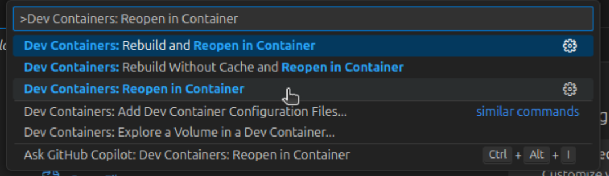

You can also click on the blue button in the bottom-left corner:

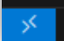

And select "Reopen in Container" from the pull-down menu:

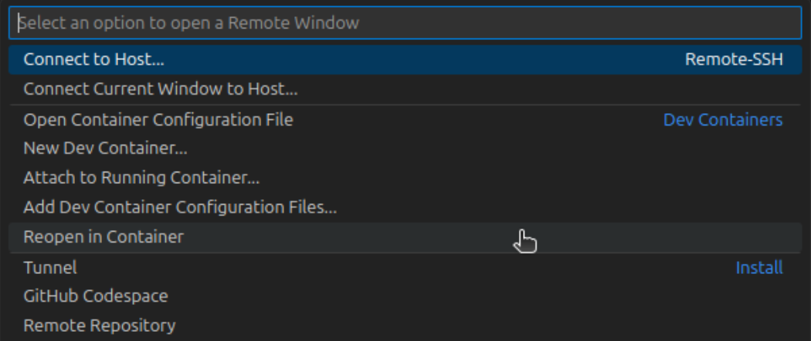

Once you do this, VS Code will re-open the directory inside the dev container. The first time you do this, it may take a few minutes for the container to be built and started, as Docker will need to install all the required software. Subsequent starts of the dev container will be much faster.

You will know the container is ready when the bottom-left corner shows the following:

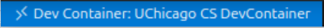

You will also be shown a terminal for the container:

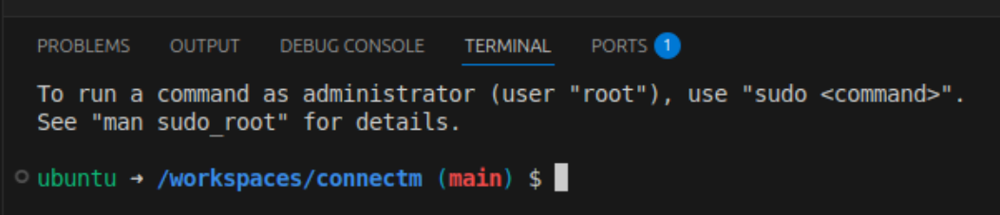

If the terminal does not appear, you can open it by going to the menu and selecting Terminal > New Terminal.

### Opening the Dev Container Again

Once the dev container has been build and run for the first time, opening it again will be much faster.

When you open your project in VS Code, you will see a pop-up in the bottom-right corner asking whether you want to "Reopen in Container":

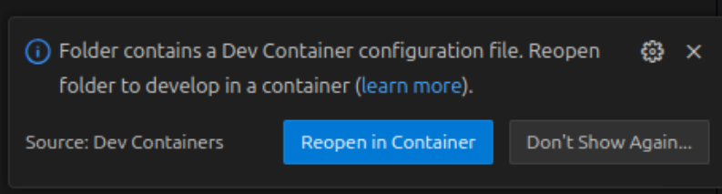

Clicking on "Reopenin Container" will reopen the directory inside the dev container, and you will see the terminal for the container.

## Using the Dev Container from the Command Line

TODO

